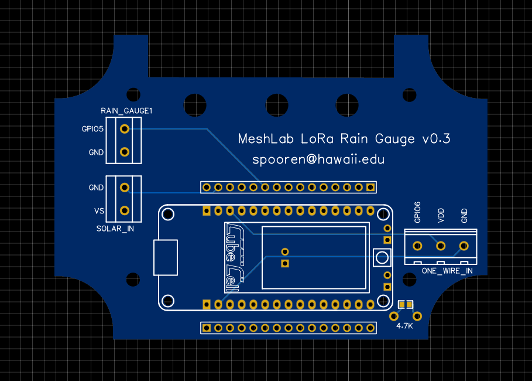
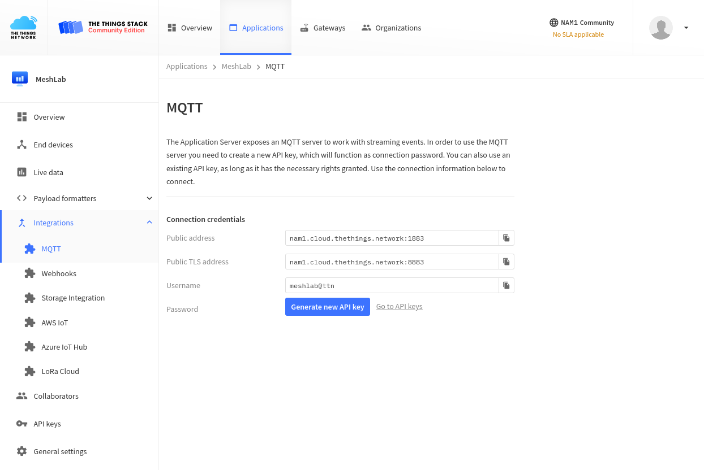
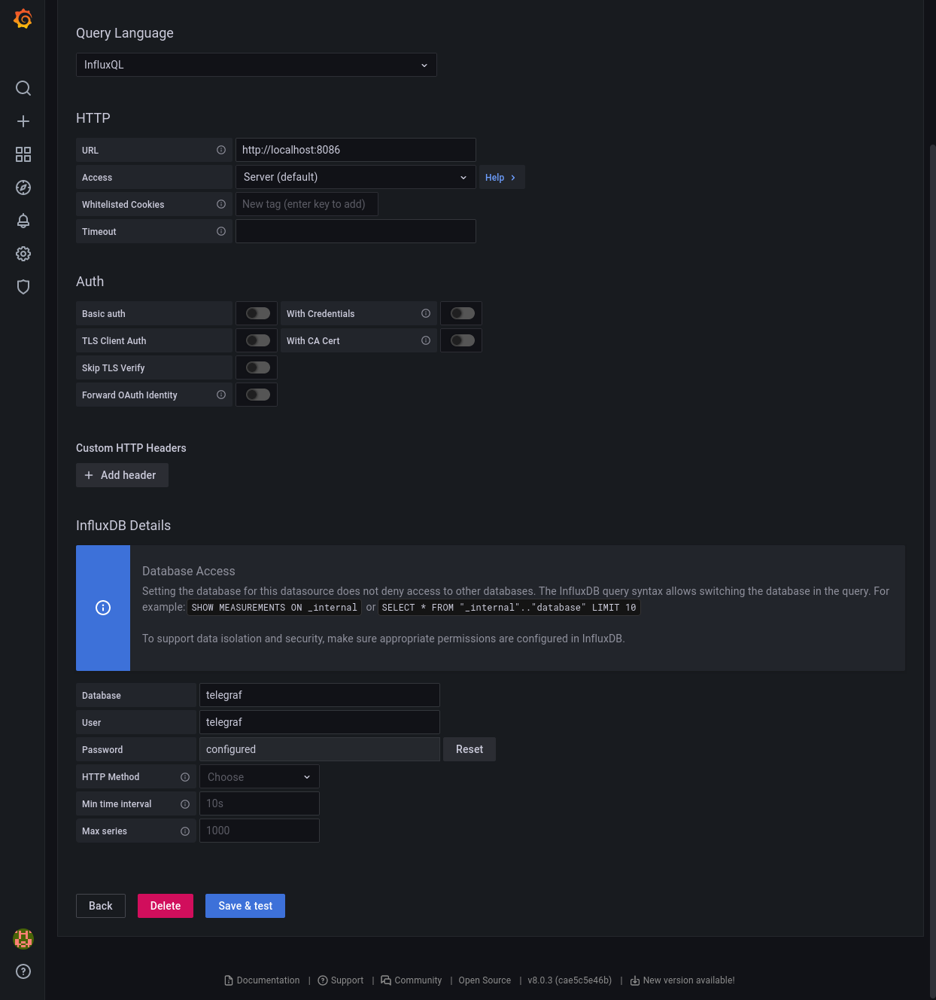
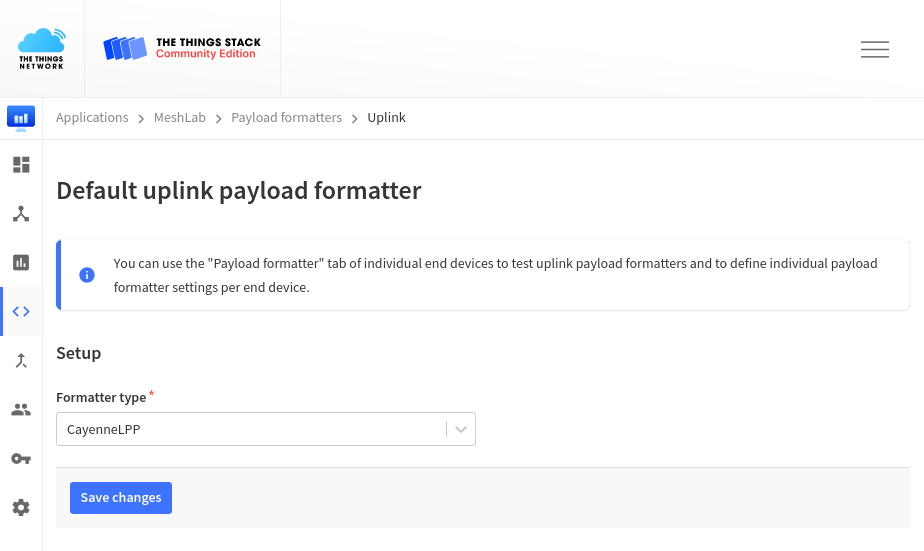



# Introduction

This project evaluates the *LoRa* frequency modulation and the *LoRaWAN* stack
as an alternative for existing sensor setups using the technologies *ZigBee* and
*GSM*. The current scope is to build a simple stack to collect sensor data end
visualize them inside a web interface.

Within this work modular nodes were designed allowing to measure a variety of
environmental metrics, including temperature, rain fall, humidity and sea level.

Software and hardware used on sensor nodes are documented to allow easy
replication of the setup. Further multiple recommendations regarding software
libraries and hardware are given.

All work happened in collaboration with the *MESH LAB* at Oahu, Hawaii,
supervised by [Dr. Brian
Glazer](https://www.soest.hawaii.edu/oceanography/glazer/Brian_T._Glazer/CV.html)
and [Dr. Edo Biagioni](http://www2.hawaii.edu/~esb/).

> Note: This manual is work in progress and may receive updates over time. A
> list of changes will be attached to the bottom with corresponding dates.

## Motivation

Based on the architecture of LoRaWAN, described in the
[TheThingsNetwork](#thethingsnetwork) section, it allows a separation of sensor
nodes and base stations. In simple terms this could be compared to a free
cellular network where every user brings their own phone while the cellular base
stations are managed by an organization with the public interest of
connectivity. With LoRaWAN it is possible for researchers to deploy their sensor
nodes while other entities, like universities or even states, handle the signal
coverage.

The existing setup aimed to upgrade and extend uses both cellular *GSM* and
*ZigBee*. While the formers base stations are managed by third parties it
involves a recurring fee of usage, making large scale deployments less feasible.
*ZigBee* requires researchers to manage their own gateways since there is no
roaming standard or protocol for multiple users to share a base station.

LoRaWAN solves this by introducing a software stack which allows multiple
entities to share base stations but also allows easy deployment of base stations
contributing to the network as a whole.

Within this project existing sensor setups where *rebuild* to use LoRaWAN
instead of *GSM* or *ZigBee*, reporting the same results while using a different
medium of transportation. Collected data is stored in the same database as
existing nodes, theoretically allowing a migration over time without changing
work flows.

## Aim

This work focuses unlike related scientific papers on a reproducible manual of
said sensor setups. Multiple papers in the [Related Work](#related-work) section
prove the usability of LoRaWan as a concept and specifically for the *Internet
of Things* and *sensor network* use case.

Specific steps to deploy a *sensor network* are described to combine available
resources to a working, low-cost live monitoring system with possible data
science pipelines.

## Structure

Within this document no specifics of the LoRaWAN protocol are covered. For
technical details on the LoRa frequency modulation or the  LoRaWAN stack the
[Related Work](#related-work) section gives further information.

In the [Hardware](#hardware) used microcontrollers and LoRaWAN gateways are
covered. Additional documentation is provided on the custom designed *Printed
circuit board* (PCB) as well as the used outdoor casing.

The [Software](#software) section describes all code and tooling used and
created within this project. Multiple sub-sections describe the full setup in
detail and should be followed in that order.

Within the brief [Resources](#resources) section the advantages of the *Cayenne
Low Power Protocol* for data transmission as well as an overview of used
sensors for multiple environmental metrics.

## Related Work

Using LoRaWAN for sensor networks is not a new idea and multiple papers describe
a variety of experiments[[1]](#references). Also the technology of LoRa
frequency modulation as well as the LoRaWAN stack was discussed in multiple
publications[[2]](#references).

This projects is similar to work of *Davec et al*[[3]](#references) where they
proof the feasibility of sensors over large distances gathering environmental
metrics, in their case specifically temperature and soil moisture.

Next to academic publications this work is based on free documentation available
online, notably the [Arduino Reference][arduino-reference] and the many code
examples by *HelTec Inc.* within their [CubeCell
repository][cubecell-repository].

Low-cost weather stations based on Arduino with custom circuit boards were also
described by the [OpenWeatherStation project][owsproject] and
[DFRobot][dfrobot], however neither uses LoRaWAN and is therefore more bound to
local installations.

Complete setups from specialized vendors like [Onset Computer
Corporation][onset-corp] offer professional weather stations, however come at a
much higher price tag as solutions within this project.

[arduino-reference]: https://www.arduino.cc/reference/en/
[cubecell-repository]: https://github.com/HelTecAutomation/CubeCell-Arduino/tree/master/libraries
[owsproject]: https://openweatherstation.com/ows/index.php#wifi-and-cell-phone-network
[dfrobot]: https://www.dfrobot.com/blog-465.html
[onset-corp]: https://www.onsetcomp.com/support/application_solutions/weather-station-kits/

# Hardware

Within this section all hardware like microcontrollers, LoRaWAN base stations
and outdoor casing are described.

## Microcontroller

This section describes the used microcontrollers and development boards used
within this setup. The microcontrollers is essentially an extremely small
computer with hardware inputs and outputs. In simple terms, sensors are attached
to the inputs and a LoRaWAN radio frequency module is connected to the outputs.

Using microcontrollers comes in two flavors, either as development boards with
populated connectors, for instance a USB port and attached LEDs or as a plain
module, which requires designing of a custom PCB. The former is used for rapid
prototyping while the latter runs on an optimized PCB which only contains
required functionality.

To simplify the development only microcontrollers compatible with the [Arduino
framework][arduino] were considered. The framework abstracts talking to low
level hardware components and offers a simple C API to control the
microcontrollers behaviour. Additionally this allows to migrate code from one
device to another with minimal code modifications sine both devices understand
the same API.

Due to low price and using the LoRaWAN reference implementation the *CubeCell*
product line from the vendor [*Heltec Automation*][heltec]. Both development
boards *CubeCell Dev-Board* (`htcc-ab01`) and *CubeCell Dev-Board Plus*
(`htcc-ab02`) as well as the plain *Module Plus* (`htcc-am02`) were used.

### Heltec CubeCell Dev-Board (Plus)


The development boards shown on the right both allow to connect sensors via
*GPIO Pins* as well as [*I2C*][i2c] or serial console. Only the bigger *Plus*
versions (bottom) contains two *Analog to Digital converter* (ADC) which are
required for some sensor like the *VH400* moisture sensor.

Additionally the *Plus* version comes with an attached LCD display which can be
used for debugging or additional information during setup. No long time tests
were performed to evaluate the UV resistance of the display.

For outdoor setups they come with a solar charge controller and battery
connector which allows the usage without a constant power supply. 

Both boards use the same microcontroller and can run the same code.

Flashing is trivial by using the USB connection and the
[Platformio framework](#platformio).

* [Dev-Board Pinout][board-pinout]
* [Dev-Board Plus Pinout][board-plus-pinout]

### Heltec CubeCell Module Plus


The *Module Plus* allows (and requires) to use custom PCB and therefore only runs
parts that are required. For production deployments the nodes would not need a
LCD screen for debugging or a USB port for flashing. These components can simply
be removed in the PCB design which reduces the number or parts, thereby cost and
complexity.

*Dev-Board Plus* and *Module Plus* use the same microcontroller and therefore
support the same connections. 

More information on the PCB required for the *Module Plus* is available in the
[PCB](#pcb) section.

* [Module Plus Pinout][module-plus-pinout]

[board-pinout]: files/heltec_htcc-ab01_pinout.pdf
[board-plus-pinout]: files/heltec_htcc-ab02_pinout.pdf
[module-plus-pinout]: files/heltec_htcc-am02_pinout.pdf
[arduino]: https://www.arduino.cc/
[heltec]: https://heltec.org/proudct_center/lora/cubecell/
[i2c]: https://www.arduino.cc/en/reference/wire

## Gateways

While the [Microcontrollers](#microcontroller) with an attached LoRaWAN radio
frequency module mostly send data, the receiving part is called gateway.
Essentially it is a device with a LoRaWAN compatible receiver attached as well
as an Internet connection. Received packages are forwarded to a brooker. More
details on that are available in the [LoRaWAN section](#thethingsnetwork)

Within this project the following three gateways were used as described below.
This was partly necessary as LoRaWAN coverage with TheThingsNetwork broker were
limited within the area of research, Honolulu, Ohau, Hawaii. At other locations
institutions or private entities may already provide coverage free of charge.
Using the [TTNMapper][ttnmapper] it's possible to see a local coverage map and
determine if a self maintained gateway is required.

### The Things Indoor Gateways


This gateway allows simple operation since it's developed by the same people as
the used LoRaWAN broker. It was used during local development and allows quick
migration between different locations. While not waterproof, using additional
casing and attaching an external antenna it can also be used as a outdoor
gateway. For mobile development it is possible to power the
gateway via a USB-C cable.

A complete install and maintenance guide is available in the [vendors
documentation][ttig] and is not replicated here.

[ttig]: https://www.thethingsindustries.com/docs/gateways/thethingsindoorgateway/

### Heltec HT-M00


Just as the [microcontrollers](#microcontroller) Heltec offers a development
gateway as [well][m00]. At the time of writing this is the cheapest development
gateway available with a price of about $40. The [upstream
documentation][m00-docs] guides through the installation process of the gateway
into TheThingsNetwork broker. For mobile development it is possible to power the
gateway via a USB-C cable.

### Mikrotik wAP LR9 kit


Lastly the outdoor LoRaWAN gateway from the vendor Mikrotik (in [900MHz][900] or
[860MHz][860]) offers the, at the time of writing, cheapest outdoor gateway.
With *Power over Ethernet* (PoE) the installation is possible with a single
Ethernet cable without requiring (ideally elevated) deployment location.

[m00]: https://heltec.org/project/ht-m00/
[m00-docs]: https://heltec-automation-docs.readthedocs.io/en/latest/gateway/ht-m00/connect_to_server.html
[ttnmapper]: https://ttnmapper.org/
[860]: https://mikrotik.com/product/wap_lr8_kit
[900]: https://mikrotik.com/product/wap_lr9_kit

## Printed Circuit Board

This section briefly describes the PCBs designed within this project. While
[breadboards][bread] are often used for prototyping with microcontroller, real
deployments should use custom PCBs since they offer a more reliable setup.

The project scope required a rain gauge sensor as well as a temperature sensor
to transmit measurements over LoRaWAN to a online database. With the below
described PCB it is possible to attach a *Heltec HTCC-AB02* as well as the two
sensors within minutes. 

### *Rain Gauge* PCB

As mentioned above the two values *temperature* and *rain fall* were to be
collected and send to an online database. First prototypes using a breadboard
and a *Heltec HTCC-AB02* worked out as expected, so the same exact circuit was
transfered in a PCB. On the right side a picture of the PCB is shown. The labels
`RAIN_GAUGE`, `SOLAR_IN` and `ONE_WIRE_IN` contain screw terminals which allow
easy attaching of the sensor cables.



Below is a printed and mostly assembled (missing 4.7k resistor) board. The
*CubeCell board* can be directly attached to the pin headers, the labeled screw
terminals allow a simple connection of sensors. Next to the attached pin headers
is a second row of pins which can be used for developing to connect any other
GPIO which might be of interest in the future.


An [EasyEda][easyeda] project file is available
[here](files/rain-box_htcc-ab02-v0.3.zip) for customization or ordering
online.

Additionally the *BOM*, *Gerber* and *Pick & Place* files are available:

* [BOM_PCB_rain-box_htcc-ab02.csv](files/BOM_PCB_rain-box_htcc-ab02.csv)
* [Gerber_PCB_rain-box_htcc-ab02.zip](files/Gerber_PCB_rain-box_htcc-ab02.zip)
* [PickAndPlace_PCB_rain-box_htcc-ab02.csv](files/PickAndPlace_PCB_rain-box_htcc-ab02.csv)

The PCB has a custom cutting so it fits perfectly into the outdoor case
[PTK-18420-C][case] by *Bud Industries, Inc.*. It is important to order the `C`
version since a **clear cover** is required to allow solar charging. Using cable
glands it's possible to connect external sensors. The picture below shows two
possible positions for `7mm` holes to attach `PG7` cable glands. Silicon was
added around the cable glands for better long term water resistance.


The full box specifications are available on the [vendors website][case] or as
an attached [resource](files/box_hbptk18420.pdf).

It is possible to use the *Pick and Place* file to
order all parts soldered on or solder all components manually. In that case a
`4.7K` resistor should be added on the bottom left instead of a flat resistor.

A picture of an assembled *Rain Box* is shown below. The picture shows four
different setups of the rain gauges. 

* The **left box** has a [HOBO RG3 rain gauge][hobo]
* The **middle box** has only a [DS18B20 temperature sensor][ds18b20] is
  connected inside the box. This was done to measure the maximum daily
  temperature inside the box.
* The **right box** has both a temperature sensor and a [MISOL rain
  guage][misol] attached. By the time of writing (2021-09-16) the official
  vendor website is unreachable.
* In **front** is a PCB board without a box showing a connected *Heltec
  HTCC-AB02*.


### PCB Editor

To design PCBs a variety of tools is available for free. However the number of
tools that are available on the three main platforms Windows, MacOSX and Linux
is limited. Within this project [EasyEda][easyeda] was used for it's simple usage
and integration with part libraries, which would simplify the ordering process.

EasyEda comes with a tight integration of the PCB vendor *JLCPCB* which offers
both creation of PCBs and also soldering of selected components. 

An extensive official documentation is available in English on the [vendors
website][easyeda-docs] include [video tutorials][easyeda-video].


If EasyEda is not an option the open source tools [LibrePCB][librepcb] or
[KiCad][kicad] could be used instead, however they are not covered here.

[bread]: https://en.wikipedia.org/wiki/Breadboard
[easyeda]: easyeda.com/
[case]: https://www.budind.com/product/nema-ip-rated-boxes/ptk-series-fiberglass-box/ptk-18240-2/#group=series-products&external_dimensions_group=0&internal_dimensions=0&cover_style_group=0
[hobo]: https://www.onsetcomp.com/products/data-loggers/rg3/
[ds18b20]: https://www.adafruit.com/product/381
[misol]: https://www.amazon.com/MISOL-Spare-weather-station-measure/dp/B00QDMBXUA/
[librepcb]: https://librepcb.org/download/
[kicad]: https://www.kicad.org
[easyeda-docs]: https://docs.easyeda.com/en/FAQ/Editor/index.html
[easyeda-video]: https://www.youtube.com/channel/UCRoMhHNzl7tMW8pFsdJGUIA/videos

# Software

This section describes all code and tooling used and created within this
project. It is recommended to read the [Hardware section](#hardware) first to
have the required sensor nodes.

## TheThingsNetwork

This section gives a brief introduction to the free *TheThingsNetwork* service
which provides a *Network server* to handle LoRaWAN authentication, forwarding
and data access. More information on the LoRaWAN stack *Rizzi et
al*[[2]](#papers) give a great introduction how communication from sensor node
to user facing *Application server* works.

In short, *TheThingsNetwork* is a free, partly commercial, partly community
driven service which handles the management of nodes, keys, base stations and
APIs to access collected data. The picture below show a simplified overview of
the stack.


Sensor **Nodes** collect data and send it via LoRa radio frequency modulation
(red lines) to **Gateways**. A gateway has a LoRa compatible radio module and
antenna attach and listens for incoming messages. Once received, messages are
forwarded to a broker or **Network Server**. The network server, in this setups
case thethingsnetwork.org, manages user accounts and **applications**. Each
application has multiple **Nodes** assigned with individual login credentials.
Forwarded messages from gateways are offered via [MQTT][mqtt] to user of
specified application. User controlled **Application Servers** can listen to
MQTT streams and store sensor data for further processing.

No user can access applications of other users and all traffic, starting from
sensor nodes until the application server is encrypted. This allows a federation
of infrastructure since multiple entities can share access to a single gateway
without being able to manipulate each others data.

As an outcome, both private hobbyists and institutions like universities can
offer gateway access and thereby work together to cover large areas. Different
projects don't have to manage their infrastructure independently but can share
gateways. Since all traffic is encrypted and authenticated as defined by the
LoRaWAN standard, no code has to be written by users to allow secure
connections.

Lastly multiple integrations allow even easier setups than described within this
document. Instead of running a self managed database, it is also possible to
rely on cloud services storing MQTT messages and offering convenient interfaces.

### Web interface (Console)

The cloud service requires a free online account and the setup of an
**Application**. Each application then contains multiple **End devices** which
which provide sensor data. Received data is offered via an MQTT API can should
be consumed by a user controlled database, in this setup [InfluxDB](#influxdb)
or one of the integrations.

Within this project the [*North American Cloud* (nam1)][nam1] was used, other
locations should use *Europe 1* (eu1) or *Australia 1* (au1). While the outdated
v2 stack is still offered, it **should not be used** due to it's upcoming end of
life (December 2021). Many resources online still document the *v2* which should
be avoided.

[nam1]: https://nam1.cloud.thethings.network/console/


The above image shows currently active end devices, their identifiers as well as
the time of the last received message.



Aboves picture shows the MQTT login credentials which can be either used within
the InfluxDB setup to have *Telegraf* listen to MQTT and store data or for other
applications.

In the code appendix is a short Python script called
[`mqtt2json.py`](#mqtt2jsonpy) which listens to the MQTT stream and outputs
lines of JSON which can be consumed by other applications.  A generic script
like this allows custom downstream handling of incoming sensor data. As proof of
concept the script below is parsed by another tool adding measurements to a SQL
database and visualize them via a custom web page[grogdata]. Nodes are
identified via the `from` field and all payload is stored in the `p` field,
containing data fields based on [CayenneLPP](#cayenne).

[grogdata]: https://grogdata.soest.hawaii.edu/staging/nodepage/node-301/
[mqtt]: https://mqtt.org

Below is an example output of the script which could be read by future tooling
using the [*JSON Lines* standard][jsonlines]

[jsonlines]: https://jsonlines.org/

```
{"from": "rain-box-5", "p": {"temperature_1": 23.1}}
{"from": "rain-box-1", "p": {"temperature_1": 23.5}}
{"from": "sonic-2", "p": {"distance_1": 4.991}}
{"from": "rain-box-6", "p": {"temperature_1": 21.4}}
{"from": "rain-box-4", "p": {"digital_out_1": 2, "voltage_1": 4.15}}
{"from": "sonic-2", "p": {"distance_1": 5}}
{"from": "rain-box-5", "p": {"digital_out_1": 2, "voltage_1": 4.22}}
{"from": "sonic-2", "p": {"distance_1": 5}}
{"from": "rain-box-4", "p": {"temperature_1": 24.7}}
{"from": "rain-box-5", "p": {"temperature_1": 23.6}}
{"from": "rain-box-1", "p": {"temperature_1": 23.6}}
{"from": "sonic-2", "p": {"distance_1": 5}}
{"from": "rain-box-6", "p": {"temperature_1": 21.5}}
{"from": "rain-box-3", "p": {"temperature_1": 24.1}}
{"from": "sonic-2", "p": {"distance_1": 5}}
{"from": "sonic-2", "p": {"distance_1": 5}}
{"from": "rain-box-4", "p": {"temperature_1": 24.6}}
{"from": "rain-box-5", "p": {"temperature_1": 23}}
{"from": "rain-box-1", "p": {"temperature_1": 23.7}}
...
```

## Platformio

This section describes the usage of the *Platformio* framework for embedded
development. Similar to the [*Arduino IDE*][ide] it allows the management of
dependencies and compilation for a wide variety of devices.

Due to its simple installation and full support for the used hardware it was
preferred over other the *Arduino IDE*, however other tooling should be possible
as well.

### Installation

A full installation guide is available in the [upstream documentation][pio]
however the basic installation boils down to a running Python 3 installation
combined with the Python Packet Manager or `curl`:

```bash
pip install -U platformio

# or

python3 -c "$(curl -fsSL https://raw.githubusercontent.com/platformio/platformio/master/scripts/get-platformio.py)"
```

After the installation the shortcut `pio` executes the binary.

### Creating a project

Adding projects is as easy as creating a folder and running `pio` to initialize
the project in the current folder.

```bash
mkdir project/ && cd project/
pio project init
```

After the initialization the following files are created:

```bash
include/       # header files
lib/           # libraries
platformio.ini # platformio configuration file
src/           # source code (e.g. main.cpp)
test/          # automatic tests
```

See the Git repository folder `node/` to see the main project structure.

### `platformio.ini`

The configuration file contains one or multiple environments per used device
type. Within this projects environments for the devices `cube_cell_board`,
`cubecell_board_plus` and `cubecell_module_plus` are used. The file below shows
one of the three environments and defines multiple aspects or the project which
simplify development:

* `board_build.ardiono.*` defines values passed during compile time to enable
  and configure specific features.
* `upload_port` defines the local connection, which allows to have multiple
  devices connected at once and test them in parallel
* `lib_deps` defines all required dependencies which can be hosted within the
  Platformio [registry][registry] or Git repositories directly.

```ini
[env:cubecell_board_plus]
board = cubecell_board_plus
platform = asrmicro650x
framework = arduino
board_build.arduino.lorawan.region = US915
board_build.arduino.lorawan.netmode = OTAA
board_build.arduino.lorawan.adr = ON
monitor_speed = 115200
upload_port = /dev/ttyUSB0
lib_deps = 
	https://github.com/ElectronicCats/CayenneLPP.git#master
	bblanchon/ArduinoJson @ ^6.17.2
	practicalarduino/SHT1x@0.0.0-alpha+sha.be7042c3e3
```

### Flashing nodes

Once a sensor node is connected it's can be flashed using the following command:

```shell
pio run --target upload
```

For convenience it is also possible to upload and monitor the serial output at
once:

```shell
pio run --target upload --target monitor
```

[ide]: https://www.arduino.cc/en/software/
[pio]: https://docs.platformio.org/en/latest//core/installation.html
[registry]: https://platformio.org/lib

## Sensor Node

This section describes the software used on sensor nodes. All code is deployed
on devices as described in the [Platformio section](#platformio). After flashing
nodes are provisioned using the [`provision_node.py`](#provision_nodepy) script
in combination with YAML files containing the per device specific information.

The detail section below contain the following content:
* [config.h](#configh) Contains node specific configuration options, like the
  sensors to enable on which PINs. This should be modified per use case, for
  instance when creating a new series of rain gauges measuring moisture as well,
  the sensor should be enabled here. Per node configuration happens via the
  `provision_node.py` script after flashing.
* [main.cpp](#maincpp) Contains the main loop which connects to sensors and
  sends LoRaWAN packets.
* [VH400.cpp](#vh400cpp) Minimal library to communicate with *VH400* moisture
  sensor.
* [MB7389.cpp](#mb7389cpp) Minimal library to communicate with *MB7389*
  ultrasonic sensor.


### Using `provision_node.py` for `AT_Commands`

The *Heltec Dev Boards* allow the configuration of certain on-device variables
via `AT_Commands`. Those commands can be communicated via a serial connection
(e.g. over USB) and modify per-device specific LoRaWAN credentials or user
defined values.

A list of the most important `AT_Commands` is shown below:

| AT Command               | Value |
| ---                      | ---   |
| +LORAWAN=1               | LoRaWAN  1, LoRa 0 |
| +OTAA=1                  | OTAA -1, ABP-0   |
| +Class=A                 | Class A or C   |
| +ADR=1                   | 1 on 0 for off   |
| +IsTxConfirmed=1         | LoRaWAN ACK Message 1 on, 0 off.   |
| +AppPort=2               | The Application Port 2 for general APPs and 10 for TTN MAPPER.   |
| +DutyCycle=60000         | The time between transmission in mS. Typically, 15000 to 3600000   |
| +DevEui=???              | Unique (OTAA Mode)  |
| +AppEui=???              | Unique (OTAA Mode) |
| +AppKey=???              | Unique (OTAA Mode)   |
| +ChipID=?	           | get ChipID |
| +JOIN=1	           | start join |

To allow managing multiple devices YAML configuration files are used containing
credentials of nodes. After flashing a node via [Platformio](#platformio) a node
can be configured by running a command like the folloing:

```python
python provision_node.py rain-box-1
```

Below is an illustrative content of `./nodes/rain-box-1.yml`. All contents of
the `at_commands` dictionary are executed via the provision script. All other
values like `case` and `sensors` can be used to keep an inventory in a
machine-readable format.

The special value `mmPerTip` is a *user* `AT_Commands` which is defined within
`main.cpp` and determines how many millimeters a rain gauge tip adds to the
total value.

```yaml
case: 
  type: PTK-18420-C
  label: rain-box-1

sensors:
  - HOBO RG-3

at_commands:
  DevEui: 0025307XXXXXXXXX
  AppEui: 70B3D57ED003A1D1
  AppEui: 70B3D57XXXXXXXXX
  AppKey: 1F41DD0XXXXXXXXXXXXXXXXXXXXXXXXX
  mmPerTip: 0.3851
```

## InfluxDB Database

This sections covers briefly the setup of InfluxDB, a time series database which
allows storing and querying metrics. Just like all other tools used within this
document it's open source and all [code is available online][github-influxdb].

Using InfluxDB comes with the two advantages of offering integrations for both
[Grafana](#grafana) as well consuming MQTT events, which is the way the
[LoRaWAN brooker](#thethingsnetwork) reports metrics.

### Installation of InfluxDB

> While InfluxDB 2.0 was released this year, this document describes the setup and
usage of InfluxDB 1.8. All tooling should be compatible with both versions and a
migration guide might be added later on.

The upstream documentation explains the installation process for various setups,
for the RaspberryPi setup the [Ubuntu & Debian][influxdb-install] steps should
be followed. Within this documentation both database and user are called
`telegraf`, however other use cases may use other values.

### Installation of Telegraf

> Telegraf is used to consume MQTT events and store them inside InfluxDB. 

InfluxDB and Telegraf are both developed by *InfluxData Inc.*, so a similar
installation process is offered. Again the official installation guide for
[Ubuntu & Debian][telegraf-install] should be used. 

Once installed a custom configuration is required to consume data from
TheThingsNetwork and store them locally. All values in `<...>` should be changed
accordingly to the actual setup.

```toml
# /etc/telegraf/telegraf.conf
[global_tags]
[agent]
  interval = "10s"
  round_interval = true
  metric_batch_size = 1000
  metric_buffer_limit = 10000
  collection_jitter = "0s"
  flush_interval = "10s"
  flush_jitter = "0s"
  precision = ""
  hostname = ""
  omit_hostname = false

[[outputs.influxdb]]
  database = "telegraf"
  urls = [ "http://localhost:8086" ]
  username = "<influxdb_username>"
  password = "<influxdb_password>"

[[inputs.mqtt_consumer]]
  servers = ["tcp://nam1.cloud.thethings.network:1883"]                                              
  topics = [ "#" ]
  username = "<thethingsnetwork_username>"
  password = "NNSXS.<thethingsnetwork_api_token>"
  data_format = "json"
  tag_keys = [
    "end_device_ids_device_id"
  ]
```

Once both services are running one should proceed setting up
[Grafana](#grafana) to create a dashboard presenting collected metrics.

[github-influxdb]: https://github.com/influxdata/influxdb/
[influxdb-install]: https://docs.influxdata.com/influxdb/v1.8/introduction/install/
[telegraf-install]: https://docs.influxdata.com/telegraf/v1.19/introduction/installation/

## Grafana Dashboard

Presenting collected data is important to make them accessible and give an
overview of events before starting in-depths analytics. While multiple
approaches to visualize data exists, this section describes the setup of
Grafana.

The advantages of Grafana compared to other solutions is the fact that without
any coding skills appealing graphs and gauges can be created, offering a live
and interactive user interface.

Within this setup the combination with the [InfluxDB database](#influxdb) is
described, however it is possible to visualize [other data sources][datasources]
via Grafana.

[datasources]: https://grafana.com/docs/grafana/latest/datasources/

### Installation

To allow a cheap and reproducible setup these steps are done on a RaspberryPi
running [Raspbian], which allows low cost data hosing without requiring any
server setups. However it is equally possible to run this on a virtual machine
or even a laptop for testing.

The Raspbian ports of Grafana are outdated and therefore the official
Grafana repository is used instead:

```bash
echo "deb https://packages.grafana.com/oss/deb stable main" | \docs
	sudo tee -a /etc/apt/sources.list.d/grafana.list 
wget -q -O - https://packages.grafana.com/gpg.key | sudo apt-key add -
sudo apt update
sudo apt install -y grafana-rpi
```

More details on the Grafana installation steps are available in the official
[documentation][grafana-debian].

### Adding InfluxDB as data source

This setup run both Grafana as well as InfluxDB on a single RaspberryPi.
Therefore it's possible to access the data locally. Other setups may use remote
database on distributed systems, where data is stored on different machines than
visualized.



InfluxDB runs per default on port `8086` and if running, is available on
`localhost`. None of the extra options need to be activated since a local setup
doesn't require extra authentication settings except the login credentials set
in the [InfluxDB database](#influxdb) setup.


### Configure a graphs

A generic manual to add graphs or *panels* is provided by the Grafana Project
itself within their [documentation][panel].

This example describes how to get the battery voltage of all available nodes.
A running InfluxDB receives data via *Telegraf*, feeding a MQTT stream into the
time series database. If using the same options as in the InfluxDB section,
Grafana will present a `mqtt_consumer` table from which data can be selected.

Since the [CayenneLPP](#cayennelpp) protocol is used to encode senor
data for LoRaWAN transmission, all fields in the table follow a specific schema:

```
uplink_message_decoded_payload_<cayennelpp_type>_<cayennelpp_id>
```

All metrics start with `uplink_message_decoded_payload` since that contains
transmissions from the node. Other fields may contain IDs of used gateways or
transmission quality (`uplink_message_rx_metadata_0_rssi`), however these are
more relevant to monitor the nodes *health*.

The field of our interest is voltage with the ID `1`, the field is therefore
called as follows:

```
uplink_message_decoded_payload_voltage_1
```

Once the field is selected measurements should be *grouped by* the device IDs.
Grouping by means that a graph is created per device instead of showing all data
in a single graph. The *tag* for grouping is called `end_device_ids_device_id`.

Lastly to improve readability it is possible to assign an *alias* to each graph.
Instead of having the lengthy full description of a measurement (see below) only
the device identifier can be shown. To do so the special value
`$tag_end_device_ids_device_id` is added to the *alias* field.

```
mqtt_consumer.uplink_message_decoded_payload_voltage_1 {end_device_ids_device_id: rain-box-6}
```


[panel]: https://grafana.com/docs/grafana/latest/panels/add-a-panel/

### Example Dashboard

Below is a screenshot of a demo setup which includes two graphs of measured
metrics (rain fall and temperature) and below an overview of the nodes over the
last week. It is possible to interactively select smaller and bigger time frames
and see precise values for specific times and dates.


Aboves two graphs show rain events that happened at different location in
Honolulu, Hawaii. It's possible to zoom into specific time ranges to see the
total amount of rain for that day, hour or minute.

The temperature graph below the *rain fall* shows a repeating pattern of
temperature changes. Two special cases are handled in this graph showing where
`rain-box-1` shows the *inner enclosing temperature* and `rain-box-6` is
stationed in a cooled lab, therefore the constantly low temperature.

Additional values can be measured to track the *health* of sensors, most
importantly the battery voltages and connection quality (*RSSI*).


The graph above shows how the battery voltage is dropping every night but
recharged on sunrise.


On the contrary, above graphs show that the node `sonic-2` doesn't recharge via
it's attached solar panel and therefore shuts off once the battery voltage is to
low for further LoRa transmissions. The node need manual inspection and
probably a solar panel replacement.


The graph above shows shows the varying values of RSSI, which describes the
connection quality. For LoRa values down to **-120dB** are fine for a stable
connection, so the node `rain-box-1` should have a stable connection.

[raspbian]: https://www.raspberrypi.org/downloads/raspbian/
[grafana-debian]: https://grafana.com/docs/grafana/latest/installation/debian/

# Resources

## CayenneLPP

This section explain CayenneLPP (Low Power Protocol) which is used to encode
data on sensor nodes into a size efficient format and decode it in the backend
back for further processing.

*Cayenne* is a platform developed by [*myDevices Inc.*][mydevices] offering
custom dashboards for device monitoring, alerts and more. They developed
[CayenneLPP][llp] and multiple open source implementation ([C][cats],
[Python][py] of that protocol exists. The protocol allows a compromise between
self describing data packets and size efficiency, which will be explained in the
next section.

This sections below show three ways to encode node data to a binary format for
sending over LoRa, a custom *raw* format, *JSON* and CayenneLPP. The example
data is a **temperature** value of 18.6 degree Celsius, a **battery voltage** of
3.9V and a **distance** value of 43mm.

### Encoding using raw Bits

The smaller a LoRaWAN packet is the less power is required to send it and the
more airtime is available for other sensors. A simple solution would be just
store all sensor data as binary fields one after another. The packet could have
the following format:

```
<temperature><voltage><distance>
```

Representing floats in binary isn't trivial to instead a prevision can be
defined. For **temperature** two float digits are enough, for **battery
voltage** a single float digit is fine and **dinstance** is always a integer.

This means values can be multiple by `100` respectively `10`. The temperature value
becomes `1860` and the voltage becomes `39`. Both considering that measured
temperature will never be above 99.99 degree Celsius and batter voltage should
exceed 9.9V (4.2V really). For distance a maximum of 5000mm should be used.

To calculate the maximum bits needed data, the maximum values are converted to
binary format the bit counted, easily possible with some Python:

```python3
>>> format(9999, "b") # max value
'10011100001111'
>>> len(format(9999, "b"))
14
>>> format(99, "b") # max value
'1100011'
>>> len(format(99, "b"))
7
>>> format(5000, "b") # max value
'1001110001000'
>>> len(format(5000, "b"))
13
>>> 
```

Above calculation shows that **14** Bits are needed for temperature, **7** for
battery voltage and **13** for distance. Now the custom data format becomes more
specific as shown below:

```
| temperature 14 | volt 7  | distance 13   |
| xxxxxxxxxxxxxx | xxxxxxx | xxxxxxxxxxxxx |
```

Below we calculate the specific values and pad them with zeros.

```python3
>>> format(1860, "b")
'11101000100'
>>> format(39, "b")
'100111'
>>> format(43, "b")
'101011'
```

The resulting packet would look like this with a total size of **34 Bits**.

```
| temperature 14 | volt 7  | distance 13   |
| 00011101000100 | 0101011 | 0000000101011 |
```

The receiving backend could decode this data by reading the first 14 Bits as
integer and dividing the value by 100 to calculate the temperature, followed by
reading Bit 15 until 21 as integer and dividing it by 10 to calculate the
battery voltage. The remaining 13 Bit can be directly read as distance.

While this approach works and data is efficiently exchanged between sensor node
and backend, the calculation is not trivial to understand. More problematic is
the extendability of this approach: Newly added sensors may use a different
set of sensors and therefore require data fields. As the exchanged data is just
Bits, it's not possible to know what the data contains. In other words, the
format is extremely static and ideally the data would be more self explaining so
a backend would know what value it is decoding.

### Encoding using JSON

The JSON format is extremely popular in web application to exchange all kinds of
data. It is human readable, supports all our data types directly (float and
integer) and allows to verbosely describe data fields. The example data could be
decoded as below:

```json
{
	"temperature_1": 18.6,
	"voltage_1": 3.9,
	"distance_1": 43
}
```

As printed above, the format would take a total of 73 Bytes (584 Bits) which is
nearly 20 times bigger than using the raw format. Even a slightly optimized
version as shown below would still require 28 Bytes (224 Bits) meaning 7 times
bigger.

```json
{"t1":18.6,"v1":3.9,"d1":43}
```

### Encoding using CayenneLPP

CayenneLPP uses a compromise of both approaches, the data is very compact while
being self descriptive. To archive that common measurement types are available
with a 1 Byte data type descriptor and a 1 Byte data type channel (or ID). Each
data type, be it temperature, GPS or relative humidity is described by a number
between 0 and 255, a official reference implementation is available in the
[Cayenne Docs][cayenne-docs]. Since all data types are based on [IPSO data
types][ipso] other implementations support [additional values][cats-api], like
voltage, altitude and distance.

Adding those values on device is done by a creating a `CayenneLPP` frame and
adding values. More details are available in [`main.cpp`
implementation](#sensor-node), however below is an simplified example.

```C
CayenneLPP lpp(LORAWAN_APP_DATA_MAX_SIZE);      // create frame
lpp.addVoltage(1, getBatteryVoltage());         // add voltage
lpp.addDistance(1, distance);                   // add distance in mm
lpp.addTemperature(1, temperature);             // add temperature in Celsius
appDataSize = lpp.getSize();                    // calculate size
memcpy(appData, lpp.getBuffer(), appDataSize);  // copy Bytes to LoRaWAN packet
```

The same is possible to do via Python using the [`pycayennelpp`][py] package:

```python
from cayennelpp import LppFrame

frame = LppFrame()
frame.add_temperature(0, 18.6)
frame.add_distance(1, 43)
frame.add_voltage(1, 3.9)
buffer = bytes(frame)
print(len(buffer))
```

The result are **14 Bytes** and thereby half the size of using JSON. For
measurements which are not directly supported by the implementations, like
*number of satelites* for GPS measurements, it is possible to use the commands
`addDigitalInput` or `addDigitalOutput` (unsigned  32 Bit Integer) and
`addAnalogInput` or `addAnalogOutput` (float with 3 decimals).

### Decoding in Backend

The receiving backend allows to decode incoming data before offering it via
MQTT. This is very useful so different applications listening to the MQTT stream
can directly process the decoded payload rather than implementing that per
client, allowing as well to upgrade the communication used for nodes without
modifying clients.

TheThingsNetwork offers to automatically decode CayenneLPP frames using the
*Payload Formatter* menu entry.



However, since TheThingsNetwork uses the reference implementation of *MyDevices*
they don't support decoding some additional data types, like distance. If these
measurements are used it is possible to use a custom JavaScript decoder as
offered by *ElectronicCats* to be used directly in TheThingsNetwork. The
[`decoder.min.js`][decoder] can be pasted into the text field of the *Payload
Formatter* menu entry:

> The `min` decoder version is required as TheThingsNetwork limits the total
> size of decoding scripts and the formated version exceeds that limit.


### Used payload types

Within this project the following payload types and IDs are used.

| JSON value      | description                        |
| ---             | ---                                |
| `analog_in_1`   | rain mm/m                          |
| `analog_in_2`   | soil moisture                      |
| `digital_out_1` | running software version (integer) |
| `temperature_1` | temperature                        |
| `voltage_1`     | battery voltage                    |
| `distance_1`    | distance to sea level              |

[mydevices]: https://developers.mydevices.com/cayenne/features/
[llp]: https://developers.mydevices.com/cayenne/docs/lora/#lora-cayenne-low-power-payload
[cats]: https://github.com/ElectronicCats/CayenneLPP/
[cats-api]: https://github.com/ElectronicCats/CayenneLPP/blob/master/API.md#methods-add
[py]: https://github.com/smlng/pycayennelpp
[cayenne-docs]: https://developers.mydevices.com/cayenne/docs/lora/#lora-cayenne-low-power-payload-reference-implementation-cayenne-lpp-cc-constants-definitions
[ipso]: https://technical.openmobilealliance.org/OMNA/LwM2M/LwM2MRegistry.html#extlabel
[decoder]: https://github.com/ElectronicCats/CayenneLPP/tree/master/decoders


## Sensors

This section describes briefly sensors used within this project. All of them are
supported by the *Arduino* framework an can be connected in any variation to the
described [microcontrollers](#microcontroller).

### Distance

To measure the distance between a fixed point and sea level the ultrasonic
**MB7389** sensor from *MaxBotix Inc.* was used. It offers a distance range of
`300mm` to `5000mm` (`5m`). Measurements happen 6 times per second and are
readable via an analog, pulse width or serial output. The easiest implementation
is done by using [Arduinos `softwareserial`][softwareserial] and read the
distance values as chars. A full data sheet is available on the [vendors
website][distance].

[softwareserial]: https://www.arduino.cc/en/Reference/SoftwareSerialConstructor
[distance]: https://www.maxbotix.com/documents/HRXL-MaxSonar-WR_Datasheet.pdf

### Rain fall

For rain fall two different rain gauges are used. While one is the de-facto
standard for scientific publications, the other allows measurements at a much
lower price. Both are usable by using a simple tip counter via an `GPIO`
interrupt and are simply connected to a `GND` PIN and whichever PIN was
configured with the interrupt.

#### ONSET HOBO RG-3

The **HOBO Rain Gauge** by *Onset Computer Corporation* offers a high quality
metal casing and is described as the default rain gauge for scientific
publications. With it's precision comes the price of [around $400][hobo] which
may exceed the budget for some use cases.


> One tip means `0.254mm` or `0.1"` of rainfall.

[hobo]: https://www.onsetcomp.com/products/data-loggers/rg3/

#### Misol WH-SP-RG

An alternative to is the **WH-SP-RG** by *Misol*. At the time of writing
(2021-09-21) the vendors website is not reachable, however other websites sell
the rain gauge for [around $20][misol].

> One tip means `0.3851mm` of rainfall.

[misol]: https://www.amazon.com/MISOL-Spare-weather-station-measure/dp/B00QDMBXUA/

### Soil Moisture

For soil moisture the **VH400** by *Vegetronix, Inc* is supported. The sensor is
connected to an `ADC` (*Analog Digital Converter*) PIN and the measured
resistance describes the *volumetric water content* by using a [piecewise
curve][curve] provided by the vendor. The curve is implemented in the [provided
mini library](#sensor-node). The sensor costs [around $40][vh400].

[curve]: https://vegetronix.com/Products/VH400/VH400-Piecewise-Curve.phtml
[vh400]: https://vegetronix.com/Products/VH400/

### Temperature

For waterproof temperature measuring a **DS18B20** sold by *Adafruit Industries,
LLC* is used. Adafruit ships their own libraries so minimal integration needs to
be coded. The sensor uses three wires which can be directly connected to the
[custom PCB](#pcb). The sensor costs [ardoung $10][temperature] on
the Adafruit website.

[temperature]: https://www.adafruit.com/product/381

# Conclusion

This project started initially with the evaluation of pure LoRa frequency
modulation using the Arduino library [`arduino-LoRa`][pure]. While the tests
worked fine encryption, authentication as well as link optimization needed
manual solutions. Instead of pursuing the pure LoRa approach the switch to
LoRaWAN solved all these and even allowed easily redundant base station setups
plus roaming (e.g. for buoy setups).

Sensor nodes with the custom PCB board and low-cost *Heltec Dev Boards* were
tested for multiple month in the wild and delivered stable measurements. Due to
the modular code different combinations of sensors were easy to setup and new
sensors added within hours. While writing code for the [Davis Anemometer][davis]
(wind direction and speed) is tested and may be fully supported in later
versions of the code.

During the time working on this projects multiple researcher at the *University
of Hawaii, Manoa* (UH) mentioned their interest in low-cost remote setups, using
all kinds of sensors which all would be compatible with the Arduino framework.
At the same time the [Information Technology Services][its] of *UH* collaborated
on improving the coverage of *Oahu* by deploying multiple high-performance base
stations around Honolulu.

While this project could be considered successful as in creating a *drop-in*
replacement for an existing setup and being at the extendible by other, no
*production* deployment is currently running. Due to the COVID-19 pandemic the
in-person collaboration with other scientists was lower than hoped for,
resulting in a lower variety of real setups around *Oahu*. Future work and
efforts are needed to establish LoRaWAN as the *goto* solution for wireless
metric transportation.

# Outlook

Parts of the code should be refactored to allow PIN settings of sensors via the
`provision_node.py` script rather than the `config.h` file. This would allow a
single image for all sensors and thereby requiring only Python by the scientists
deploying sensors (in contrast to the current need of [Platformio](#platformio).

Also the assembling of a LoRaWAN tracker should be fully documented. The tracker
allows interval or manual tracking of LoRaWAN coverage and can thereby be used
by scientists for evaluation of sensor node sites. Before a deployment the
tracking device would be taken in-field to verify sufficient coverage of
LoRaWAN.

Lastly a custom development board was designed to use the *CubeCell Module Plus*
instead of the development boards, which contain unnecessary parts (like LEDs
and buttons) which would not be used in production setups. The custom board is
in early development and not yet fully functional.


[its]: https://www.hawaii.edu/its/
[pure]: https://github.com/sandeepmistry/arduino-LoRa
[davis]: https://www.davisinstruments.com/products/anemometer-for-vantage-pro2-vantage-pro

# Code

Code used within this project. It could be used as a base and inspiration for
similar projects. The section consists of a *utility* section containing Python
code for monitoring and deployment and *sensor node*, `C` code which runs on
nodes.

## Utility

Monitoring and deployment code written in Python.

### `mqtt2json.py`

```python
# Copyright Paul Spooren <mail@aparcar.org>
#
# SPDX-License-Identifier: GPL-2.0-or-later

import json
from os import getenv
from sys import stderr

import paho.mqtt.client as mqtt

broker = getenv("MQTT_URL", "nam1.cloud.thethings.network")
username = getenv("MQTT_USER", "meshlab@ttn")
token = getenv("MQTT_TOKEN")

assert token is not None, "Please set MQTT_TOKEN env variable"


def on_connect(mqttc, obj, flags, rc):
    print("rc: " + str(rc), file=stderr)


def on_message(mqttc, obj, msg):
    decoded_message = json.loads(msg.payload.decode("utf-8"))

    # use this as node_id to have the unique dev_eui
    #node_id = decoded_message["end_device_ids"]["dev_eui"]

    # use this as node_id to have the human readable identifier
    node_id = msg.topic.split("/")[-2]

    if "decoded_payload" in decoded_message.get("uplink_message", {}):
        print(
            json.dumps(
                {
                    "from": node_id,
                    "p": decoded_message["uplink_message"]["decoded_payload"],
                }
            )
        )


def on_publish(mqttc, obj, mid):
    print("mid: " + str(mid), file=stderr)


def on_subscribe(mqttc, obj, mid, granted_qos):
    print("Subscribed: " + str(mid) + " " + str(granted_qos), file=stderr)


def on_log(mqttc, obj, level, string):
    print(string)


mqttc = mqtt.Client()
mqttc.username_pw_set(username, token)
mqttc.on_message = on_message
mqttc.on_connect = on_connect
mqttc.on_publish = on_publish
mqttc.on_subscribe = on_subscribe
mqttc.tls_set_context()

# Uncomment to enable debug messages
# mqttc.on_log = on_log

mqttc.connect(broker, 8883, 60)
mqttc.subscribe("#", 0)

mqttc.loop_forever()
```

### `provision_node.py`

```python
# Copyright Paul Spooren <mail@aparcar.org>
#
# SPDX-License-Identifier: GPL-2.0-or-later

import serial
import sys
import yaml
from pathlib import Path

print(f"{sys.argv[0]} [node_name] [serial_port] [bitrage]")
if len(sys.argv) == 2:
    node_name = sys.argv[1]
else:
    node_name = "develop"

if len(sys.argv) == 3:
    node_serial = sys.argv[2]
else:
    node_serial = "/dev/ttyUSB0"

if len(sys.argv) == 4:
    node_bitrate = int(sys.argv[3])
else:
    node_bitrate = 115200

print(f"Provisioning {node_name} at {node_serial}")

if not Path(node_serial).is_char_device():
    print(f"Missing serial connection for node at {node_serial}")
    quit(1)

config_path = Path(f"./nodes/{node_name}.yml")

if not config_path.is_file():
    print(f"Missing node config at nodes/{node_name}.yml")
    quit(1)

config = yaml.safe_load(config_path.read_text())


def AT_command(key, value):
    serial_connection.write(bytes("\n", "ascii"))
    serial_connection.readline()

    at_command = f"AT+{key}={value}"
    serial_connection.write(bytes(at_command, "ascii"))
    print(at_command)
    status = serial_connection.readline().decode("utf-8")
    print(f"STATUS: {status}")
    if not status.startswith("+OK"):
        print(status)
        sys.exit(1)

    return serial_connection.readline().decode("utf-8")


serial_connection = serial.Serial(node_serial, node_bitrate, timeout=1)

for key, value in config["at_commands"].items():
    if not value:
        value = "0" * 16
    AT_command(key, str(value))

# restart node
AT_command("RESET", 1)

serial_connection.close()
```

## Sensor Node

Code running on sensor node written in `C`.

### `main.cpp`

```cpp
// Copyright Paul Spooren <mail@aparcar.org>
//
// SPDX-License-Identifier: GPL-2.0-or-later

#include "Arduino.h".
#include "LoRaWan_APP.h"
#include "MB7389.h"
#include "VH400.h"
#include "config.h"
#include <CayenneLPP.h>
#include <DallasTemperature.h>
#include <OneWire.h>
#include <SPI.h>
#include <Wire.h>
#include <softSerial.h>

#define LoraWan_RGB 0

// This section allows to store data on the device. Specifically this allows to
// store the rain gauge *mm per tip* value.
#define ROW 0
#define ROW_OFFSET 100
// CY_FLASH_SIZEOF_ROW is 256 , CY_SFLASH_USERBASE is 0x0ffff400
#define addr_rain_gauge                                                        \
  CY_SFLASH_USERBASE + CY_FLASH_SIZEOF_ROW *ROW + ROW_OFFSET

CayenneLPP lpp(LORAWAN_APP_DATA_MAX_SIZE);

// Set to BATTERY_SEND_INTERVAL to send on start
uint32_t battery_send_counter = BATTERY_SEND_INTERVAL;

// Run cycle every minute
uint32_t appTxDutyCycle = 60000;

// Send messages on specific port. For this application all data is transmitted
// on port 2. The port is used to distinguish between packet types, however
// since this implementation uses CayenneLPP which is parsed by the backend, all
// data can be sent over the same port.
uint8_t appPort = 2;

// Initialize variables required for rain gauge use
#ifdef RAIN_GAUGE_PIN
// union to store directly on EEPROM
union {
  float number;
  uint8_t bytes[4];
} mm_per_tip;

// The tip counter and mm, must reset after each cycle
static volatile uint8_t tips = 0;
static unsigned long last_switch = 0;
#endif

#ifdef DAVIS_SPEED_PIN
static uint32_t rotations = 0;
static unsigned long davis_speed_debounce = 0;
uint32_t davis_speed_send_counter = 0;
#endif

#ifdef DAVIS_DIRECTION_PIN
uint32_t davis_direction_send_counter = 0;
uint32_t davis_direction_total = 0;
#endif

// Initialize variables required for OneWire temperature
//
// The current setup only supports a single connected sensor while it is easily
// possible to monitor multiple OneWire sensors at the same time.
#ifdef ONEWIRE_PIN
OneWire onewire(ONEWIRE_PIN);
DallasTemperature onewire_sensor(&onewire);
uint32_t onewire_send_counter = 0;
float onewire_total = 0.0;
#endif

// Initialize variables required for VH400 moisture sensor
#ifdef VH400_PIN
uint32_t vh400_send_counter = 0;
float vh400_total = 0.0;
#endif

// Initialize variables for MB7389 ultrasonic distance sensor
#ifdef SONIC_RX_PIN
uint32_t sonic_send_counter = 0;
uint32_t sonic_total = 0;
softSerial sonicSerial(0, SONIC_RX_PIN);
#endif

// Prepare the outgoing packet stored in CayenneLPP format
//
// The packet might be empty and sending is omitted for that cycle.
static void prepareTxFrame() {
  lpp.reset();

  // Send battery status only every "BATTERY_SEND_INTERVAL" minutes
  if (battery_send_counter >= BATTERY_SEND_INTERVAL) {
    Serial.printf("[%i/%i] Add battery volt\n", battery_send_counter,
                  BATTERY_SEND_INTERVAL);

    // Battery voltage is stored as voltage with ID 1
    lpp.addVoltage(1, getBatteryVoltage() / 1000.0);

    // Running version is stored as digital output with ID 1
    lpp.addDigitalOutput(1, VERSION);

    // Reset counter
    battery_send_counter = 0;
  } else {
    Serial.printf("[%i/%i] Skip battery volt\n", battery_send_counter,
                  BATTERY_SEND_INTERVAL);
    battery_send_counter++;
  }

#ifdef SONIC_RX_PIN
  sonic_total += get_sonic_distance(sonicSerial, 60);
  sonic_send_counter++;
  if (sonic_send_counter == SONIC_SEND_INTERVAL) {
    Serial.printf("[%i/%i] Add sonic\n", sonic_send_counter,
                  SONIC_SEND_INTERVAL);

    // Sea level is stored as distance with ID 1
    lpp.addDistance(1, ((float)sonic_total / sonic_send_counter) / 100.0);

    // Reset counters
    sonic_send_counter = 0;
    sonic_total = 0;
  } else {
    Serial.printf("[%i/%i] Skip sonic\n", sonic_send_counter,
                  SONIC_SEND_INTERVAL);
  }
#endif

#ifdef RAIN_GAUGE_PIN
  if (tips > 0) {
    Serial.printf("Tips = %i\n", tips);

    // Rain fall is stored as analog with ID 1
    // The CayenneLPP specification do not support rain fall directly
    lpp.addAnalogInput(1, mm_per_tip.number * tips);

    // Reset counter
    tips = 0;
  } else {
    Serial.printf("Skip rain gauge\n");
  }
#endif

#ifdef DAVIS_SPEED_PIN
  davis_speed_send_counter++;
  if (davis_speed_send_counter >= DAVIS_SPEED_SEND_INTERVAL) {
    Serial.printf("[%i/%i] Add Davis speed\n", davis_speed_send_counter,
                  DAVIS_SPEED_SEND_INTERVAL);

    // Moisture is stored as analog with ID 2
    // The CayenneLPP specification do not support moisture directly
    lpp.addFrequency(1, rotations / (60 * davis_speed_send_counter));

    // Reset counters
    davis_speed_send_counter = 0;
    rotations = 0;
  } else {
    Serial.printf("[%i/%i] Skip Davis speed\n", davis_speed_send_counter,
                  DAVIS_SPEED_SEND_INTERVAL);
  }
#endif

#ifdef DAVIS_DIRECTION_PIN
  davis_direction_total += analogReadmV(DAVIS_DIRECTION_PIN);
  davis_direction_send_counter++;
  if (davis_direction_send_counter >= DAVIS_DIRECTION_SEND_INTERVAL) {
    Serial.printf("[%i/%i] Add Davis direction\n", davis_direction_send_counter,
                  DAVIS_DIRECTION_SEND_INTERVAL);

    // Moisture is stored as analog with ID 2
    // The CayenneLPP specification do not support moisture directly
    int direction =
        ((davis_direction_total / davis_direction_send_counter) / 2400) * 360;
    lpp.addDirection(1, direction);

    // Reset counters
    davis_direction_send_counter = 0;
    davis_direction_total = 0;
  } else {
    Serial.printf("[%i/%i] Skip davis_direction\n",
                  davis_direction_send_counter, DAVIS_DIRECTION_SEND_INTERVAL);
  }
#endif

#ifdef VH400_PIN
  vh400_total += read_VH400(VH400_PIN);
  vh400_send_counter++;
  if (vh400_send_counter >= VH400_SEND_INTERVAL) {
    Serial.printf("[%i/%i] Add VH400\n", vh400_send_counter,
                  VH400_SEND_INTERVAL);

    // Moisture is stored as analog with ID 2
    // The CayenneLPP specification do not support moisture directly
    lpp.addAnalogInput(2, vh400_total / vh400_send_counter);

    // Reset counters
    vh400_send_counter = 0;
    vh400_total = 0.0;
  } else {
    Serial.printf("[%i/%i] Skip VH400\n", vh400_send_counter,
                  VH400_SEND_INTERVAL);
  }
#endif

#ifdef ONEWIRE_PIN
  onewire_sensor.requestTemperatures();
  onewire_total += onewire_sensor.getTempCByIndex(0);
  onewire_send_counter++;
  if (onewire_send_counter >= ONEWIRE_SEND_INTERVAL) {
    Serial.printf("[%i/%i] Add OneWire\n", onewire_send_counter,
                  ONEWIRE_SEND_INTERVAL);

    // Temperature is stored as temperature with ID 1
    lpp.addTemperature(1, onewire_total / onewire_send_counter);

    // Reset counters
    onewire_send_counter = 0;
    onewire_total = 0.0;
  } else {
    Serial.printf("[%i/%i] Skip OneWire\n", onewire_send_counter,
                  ONEWIRE_SEND_INTERVAL);
  }
#endif

  // Copy CayenneLPP frame to appData, which will be send
  lpp.getBuffer(), appDataSize = lpp.getSize();
  memcpy(appData, lpp.getBuffer(), appDataSize);
}

// Custom commands to provision device
//
// At this point only the rain gauge command `mmPerTip` is supported, however it
// is easily possible to extend this to e.g. support height setting of the tide
// gauges or other user specific commands.
bool checkUserAt(char *cmd, char *content) {
#ifdef RAIN_GAUGE_PIN
  // This command is used to set the tipping bucket size
  // - HOBO RG3: 0.254mm/t
  // - Misol WH-SP-RG: 0.3851mm/t
  if (strcmp(cmd, "mmPerTip") == 0) {
    if (atof(content) != mm_per_tip.number) {
      mm_per_tip.number = atof(content);
      Serial.print("+OK Set mm per tip to ");
      Serial.print(mm_per_tip.number, 4);
      Serial.println("mm");
      Serial.println();
      FLASH_update(addr_rain_gauge, mm_per_tip.bytes, sizeof(mm_per_tip.bytes));
    } else {
      Serial.println("+OK Same mm per tip as before");
    }
    return true;
  }
#endif
  return false;
}

#ifdef RAIN_GAUGE_PIN
// Run on each interrupt aka tip of the tipping bucket
void handler_rain_gauge() {
  if ((millis() - last_switch) > 15) {
    tips++;
    last_switch = millis();
  }
}
#endif

#ifdef DAVIS_SPEED_PIN
// Run on each interrupt aka tip of the tipping bucket
void handler_davis_speed() {
  if ((millis() - davis_speed_debounce) > 15) {
    rotations++;
    davis_speed_debounce = millis();
  }
}
#endif

int get_direction(int davis_voltage) { return (davis_voltage / 2400) * 360; }

// The Arduino setup() function run on every boot
void setup() {
  // Set baudrate to 115200
  Serial.begin(115200);
  Serial.println("So it begins...");

#ifdef RAIN_GAUGE_PIN
  // Read mm/t from EEPROM
  Serial.println("Enable rain gauge sensor");
  FLASH_read_at(addr_rain_gauge, mm_per_tip.bytes, sizeof(mm_per_tip.bytes));
  if (mm_per_tip.number == 0.0) {
    mm_per_tip.number = DEFAULT_MM_PER_COUNT;
  }
  Serial.print("Current mm per tip is ");
  Serial.print(mm_per_tip.number, 4);
  Serial.println("mm");

  // Enable interrupt pin for tips
  PINMODE_INPUT_PULLUP(RAIN_GAUGE_PIN);
  attachInterrupt(RAIN_GAUGE_PIN, handler_rain_gauge, FALLING);
#endif

#ifdef DAVIS_SPEED_PIN
  // Read mm/t from EEPROM
  Serial.println("Enable Davis speed sensor");

  // Enable interrupt pin for tips
  PINMODE_INPUT_PULLUP(DAVIS_SPEED_PIN);
  attachInterrupt(DAVIS_SPEED_PIN, handler_davis_speed, FALLING);
#endif

#ifdef ONEWIRE_PIN
  // Setup OneWire and print single test measurement
  Serial.println("Enable OneWire sensor");
  onewire_sensor.begin();
  onewire_sensor.requestTemperatures();
  Serial.print("temperature = ");
  Serial.print(onewire_sensor.getTempCByIndex(0), 2);
  Serial.println();
#endif

  // Enable user input via Serial for AT commands
  enableAt();

#ifdef DAVIS_DIRECTION_PIN
  // Setup Davis direction sensor and print single test measurement
  Serial.println("Enable Davis direction sensor");
  pinMode(DAVIS_DIRECTION_PIN, INPUT);
  Serial.print("direction = ");
  Serial.print(get_direction(analogReadmV(DAVIS_DIRECTION_PIN)));
  Serial.println();
#endif

#ifdef VH400_PIN
  // Setup VH400 sensor and print single test measurement
  Serial.println("Enable VH400 sensor");
  pinMode(VH400_PIN, INPUT);
  Serial.print("moisture = ");
  Serial.print(analogReadmV(VH400_PIN));
  // Serial.print(read_VH400(VH400_PIN), 2);
  Serial.println();
#endif

#ifdef DAVIS_SPEED_PIN

#endif

#ifdef DAVIS_DIRECTION_PIN

#endif

#ifdef SONIC_RX_PIN
  // Print single test measurement
  Serial.println("Enable sonic sensor");
  Serial.print("distance = ");
  Serial.print(get_sonic_distance(sonicSerial, 1));
  Serial.println();
#endif

  // Set Arduino into the initialization state
  deviceState = DEVICE_STATE_INIT;

  LoRaWAN.ifskipjoin();
}

void loop() {
  switch (deviceState) {
  case DEVICE_STATE_INIT: {
    getDevParam();
    printDevParam();
    LoRaWAN.init(loraWanClass, loraWanRegion);
    deviceState = DEVICE_STATE_JOIN;
    break;
  }
  case DEVICE_STATE_JOIN: {
    LoRaWAN.join();
    break;
  }
  case DEVICE_STATE_SEND: {
    prepareTxFrame();

    // Do not send empty packages
    if (appDataSize > 0) {
      LoRaWAN.send();
    } else {
      Serial.println("Package is empty, don't send anything");
    }
    deviceState = DEVICE_STATE_CYCLE;
    break;
  }
  case DEVICE_STATE_CYCLE: {
// If sonic sensor is enabled it will measure 60 times a minute and return the
// average. This way waves don't influence tide estimations as much. Since a
// measurement is required every second the duty cycle is skipped and instead
// the get_sonic_distance function runs, which blocks for 60 seconds.
// If no sonic sensor is attached, use the
#ifdef SONIC_RX_PIN
    LoRaWAN.sleep();
    // Add random delay so sensors don't repetitively send at the same time.
    // This is done do avoid a situation where many sensors start at the same
    // time and collectively overload the gateway every 60 seconds.
    delay(randr(0, APP_TX_DUTYCYCLE_RND));
    deviceState = DEVICE_STATE_SEND;
#else
    // Same random delay is applied here.
    txDutyCycleTime = appTxDutyCycle + randr(0, APP_TX_DUTYCYCLE_RND);
    LoRaWAN.cycle(txDutyCycleTime);
    deviceState = DEVICE_STATE_SLEEP;
#endif
    break;
  }
  case DEVICE_STATE_SLEEP: {
    LoRaWAN.sleep();
    break;
  }
  default: {
    deviceState = DEVICE_STATE_INIT;
    break;
  }
  }
}
```


### `config.h`

```cpp
/*
 * Describes the currently running version. This value is transmitted next to
 * the battery voltage and helps to keep track what software version is running
 * on nodes. It should be increased whenever a significant change to logic
 * happens which may change the behaviour of a running device.
 */
#define VERSION 4

// How often to send battery voltage (and version) in minutes
#define BATTERY_SEND_INTERVAL 360 // 6 hours
// How often to send OneWire temperature in minutes
#define ONEWIRE_SEND_INTERVAL 30
// How often to send MB7389 sonic distance in minutes
#define SONIC_SEND_INTERVAL 10
// How often to send VH400 moisture in minutes
#define VH400_SEND_INTERVAL 3
// How often to send Davis wind speed in minutes
#define DAVIS_SPEED_SEND_INTERVAL 2
// How often to send Davis wind direction in minutes
#define DAVIS_DIRECTION_SEND_INTERVAL 2

/*
 * Setting PINs to devices will enable them within the code. The default values
 * presented here work fine with Heltec CubeCell boards, allowing to attach all
 * sensor at once. However it is also possible to remove any PIN definition and
 * thereby disable the sensor completely.
 */
// #define ONEWIRE_PIN GPIO4
//#define SONIC_RX_PIN GPIO1
//#define RAIN_GAUGE_PIN GPIO5
//#define VH400_PIN ADC2
#define DAVIS_SPEED_PIN GPIO5
#define DAVIS_DIRECTION_PIN ADC2

// This defines the fallback value of mm/t if not provided by the node
// configuration file. The default value corresponds to a HOBO RG3.
#define DEFAULT_MM_PER_COUNT 0.254 // 0.01"

/*
 * All options below are advanced and specifically for the LoRaWAN library used.
 * None of these values should require manual changes except when using outside
 * the US915 zone or using ABP rather than OTAA.
 */

// OTAA parameters should be set via AT commands in the configuration file.
uint8_t devEui[] = {0xC0, 0xFF, 0xEE, 0xC0, 0xFF, 0xEE, 0xCA, 0xFE};
uint8_t appEui[] = {0xC0, 0xFF, 0xEE, 0xC0, 0xFF, 0xEE, 0xCA, 0xFE};
uint8_t appKey[] = {0xC0, 0xFF, 0xEE, 0xC0, 0xFF, 0xEE, 0xC0, 0xFF,
                    0xEE, 0xC0, 0xFF, 0xEE, 0xC0, 0xFF, 0xEE, 0x42};

/*
 * While it is possible to use ABP it is not recommended, please use OTAA!
 * OTAA is more secure and allows the node and backend to negotiate an ideal
 * transmission rate to safe power and air-time.
 */
uint8_t nwkSKey[] = {};
uint8_t appSKey[] = {};
uint32_t devAddr = (uint32_t)0x0;

/*LoraWan channelsmask, default channels 0-7 sub 2*/
uint16_t userChannelsMask[6] = {0xFF00, 0x0000, 0x0000, 0x0000, 0x0000, 0x0000};

/*LoraWan region, select in arduino IDE tools*/
LoRaMacRegion_t loraWanRegion = ACTIVE_REGION;

/*LoraWan Class, Class A and Class C are supported*/
DeviceClass_t loraWanClass = LORAWAN_CLASS;

/*OTAA or ABP*/
bool overTheAirActivation = LORAWAN_NETMODE;

/*ADR enable*/
bool loraWanAdr = LORAWAN_ADR;

/* set LORAWAN_Net_Reserve ON, the node could save the network info to flash,
 * when node reset not need to join again */
// bool keepNet = LORAWAN_NET_RESERVE;
bool keepNet = false;

/* Indicates if the node is sending confirmed or unconfirmed messages */
bool isTxConfirmed = false;

/*!
 * Number of trials to transmit the frame, if the LoRaMAC layer did not
 * receive an acknowledgment. The MAC performs a datarate adaptation,
 * according to the LoRaWAN Specification V1.0.2, chapter 18.4, according
 * to the following table:
 *
 * Transmission nb | Data Rate
 * ----------------|-----------
 * 1 (first)       | DR
 * 2               | DR
 * 3               | max(DR-1,0)
 * 4               | max(DR-1,0)
 * 5               | max(DR-2,0)
 * 6               | max(DR-2,0)
 * 7               | max(DR-3,0)
 * 8               | max(DR-3,0)
 *
 * Note, that if NbTrials is set to 1 or 2, the MAC will not decrease
 * the datarate, in case the LoRaMAC layer did not receive an acknowledgment
 */
uint8_t confirmedNbTrials = 4;
```

### `VH400.cpp`

```cpp
#include "Arduino.h"

float read_VH400(uint8_t VH400_PIN) {

  float vh400_voltage = analogReadmV(VH400_PIN) / 1000.0;
  float VWC;

  // Calculate VWC based on voltages provided by vendor:
  // https://vegetronix.com/Products/VH400/VH400-Piecewise-Curve.phtml
  if (vh400_voltage <= 1.1) {
    VWC = 10 * vh400_voltage - 1;
  } else if (vh400_voltage <= 1.3) {
    VWC = 25 * vh400_voltage - 17.5;
  } else if (vh400_voltage <= 1.82) {
    VWC = 48.08 * vh400_voltage - 47.5;
  } else if (vh400_voltage <= 2.2) {
    VWC = 26.32 * vh400_voltage - 7.89;
  } else if (vh400_voltage <= 3.0) {
    VWC = 62.5 * vh400_voltage - 87.5;
  } else {
    VWC = 0.0;
  }
  return (VWC);
}
```

### `MB7389.cpp`

```cpp
#include <softSerial.h>

uint32_t get_sonic_distance(softSerial softwareSerial, uint32_t count) {
  boolean foundValue;
  boolean foundStart;
  String inString;
  uint32_t measurements = 0;
  uint32_t total = 0;
  uint32_t start;

  softwareSerial.begin(9600);
  while (!softwareSerial.available()) {
  }

  // Run loop until enough measurements were read
  while (measurements < count) {
    // Since measurements may fail resulting in a retry after 1/6 seconds, store
    // the start time so one a measurement is successfully read, start the next
    // measurement exactly a second later.
    start = millis();

    // Reset variables used to find measurement
    foundStart = false;
    foundValue = false;
    inString = "";

    // Flush software serial input
    softwareSerial.flush();

    // Loop until a single measurement is found
    while (!foundValue) {
      if (softwareSerial.available()) {
        char inChar = softwareSerial.read();
        if (foundStart == false) {
          // New measurements begin with the character `R`
          if (inChar == 'R') {
            foundStart = true;
          } else {
            // If not, skip the letter and repeat
            softwareSerial.read();
          }
        } else {
          // Measurements end with character `\r`. If any other value is found
          // add it to our measurement.
          if (inChar != '\r') {
            inString += inChar;
          } else {
            // If found character is `\r` and therefore end of a measurement,
            // check if the length is actually four character. If not, repeat
            // the process.
            if (inString.length() != 4) {
              Serial.println("incomplete measurement");
              foundStart = false;
              inString = "";
            } else {
              // Found available measurement, increase counter and begin again
              foundValue = true;
              total += inString.toInt();
              measurements += 1;
              // Wait 1 second minus the time it took to read the last
              // measurement
              delay(1000 - (millis() - start));
            }
          }
        }
      } else {
        // Give the software serial more time to read characters
        delay(50);
      }
    }
  }
  // Return average of measurements and convert it to cm (sensor returns mm)
  return (total / (count * 10)); // to cm
}
```

# References 

[1] Khutsoane, Oratile, Bassey Isong, and Adnan M. Abu-Mahfouz. "IoT devices and
applications based on LoRa/LoRaWAN." IECON 2017-43rd Annual Conference of the
IEEE Industrial Electronics Society. IEEE, 2017.

[2] Rizzi, Mattia, et al. "Evaluation of the IoT LoRaWAN solution for
distributed measurement applications." IEEE Transactions on Instrumentation and
Measurement 66.12 (2017): 3340-3349.

[3] Davcev, Danco, et al. "IoT agriculture system based on LoRaWAN." 2018 14th
IEEE International Workshop on Factory Communication Systems (WFCS). IEEE, 2018.

