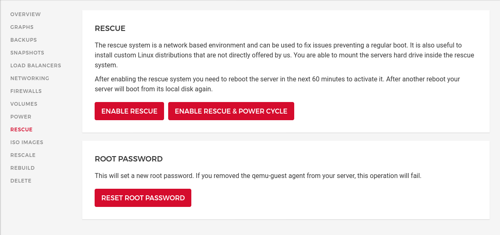

+++
title = "Running OpenWrt on Hetzner"
date = 2021-10-16
draft = false
tags = []
categories = []
+++

At this point I'm not aware of any cloud provider offering OpenWrt as an
selectable operating system. For whoever is interested in using it on the
popular cloud provider Hetzner anyway, this short manual should give an idea.

## Entering the Rescue Mode

Create any Hetzner VM with any distribution. None of the software settings
matter since it'll be overwritten by OpenWrt in a minute. Once the VM is running
enter the *Rescue* mode. For that click on *Enable Rescue & Power Cycle*
followed by clicking on a button with the same label again. I'm using the
default *linux64* as *Rescue OS*.



Once done you're shown a password to enter the root login. Login to the rescue
mode using the VM public IP address, it is the same in rescue mode and normal
operation. 

You should see something as shown below:

```shell
Linux rescue 5.13.13 #1 SMP Thu Sep 2 05:38:34 UTC 2021 x86_64

----------------------------------------------------------------------

  Welcome to the Hetzner Rescue System.

  This Rescue System is based on Debian GNU/Linux 11 (bullseye) with
  a custom kernel. You can install software as in a normal system.

  To install a new operating system from one of our prebuilt
  images, run 'installimage' and follow the instructions.

  More information at https://docs.hetzner.com/

----------------------------------------------------------------------

Rescue System up since 2021-10-16 01:52 +02:00

Hardware data:

   CPU1: Intel Xeon Processor (Skylake, IBRS)
   Memory:  1944 MB
   Disk /dev/sda: 20 GB (=> 19 GiB) 
   Total capacity 19 GiB with 1 Disk

Network data:
   eth0  LINK: yes
         MAC:  96:00:xx:xx:xx:xx
         IP:   xx.xx.xx.xx
         IPv6: 2a01:xxxx:xxxx:xxxx::2/64
         Virtio network driver
```

## Install OpenWrt

This step install a bare OpenWrt image as it's provided in the [downloads
section](https://downloads.openwrt.org/). It is possible to use custom images
and upload them via `scp` or modify the default image afterwards (unless you
want special Kernel options). Here we assume you're fine with the defaults.

Download, verify and install a *combined* (including Kernel) x86/64 SquashFS
image via the following commands:

> Note: You should not use the `ext4` since they don't support firmware upgrades
> where all configurations are kept.

```shell
# download image
wget https://downloads.openwrt.org/releases/21.02.0/targets/x86/64/openwrt-21.02.0-x86-64-generic-squashfs-combined.img.gz

# verify it's fine, checksums are shown on https://downloads.openwrt.org/releases/21.02.0/targets/x86/64/
sha256sum openwrt-21.02.0-x86-64-generic-squashfs-combined.img.gz

# unpack and install
gzip -c -d openwrt-21.02.0-x86-64-generic-squashfs-combined.img.gz | dd of=/dev/sda
```

Easy enough. However to have a network connection and allow remote SSH logins,
please follow the configuration section before rebooting.


## Configuration

For network access static IP addresses must be configured. Additionally SSH is
per default disabled on the public *WAN* interface, let's change that.

The configuration still happens inside the rescue mode! A `sysupgrade.tgz` file
is copied into the freshly installed boot partition of OpenWrt. On first boot
the `sysupgrade.tgz` file is unpacked and used as the basic configuration.

The following commands will create the archive and move it to the mounted boot
partition. Please set the env variables `IPV4` and `IPV6`.

```shell
export IPV4="xx.xx.xx.xx"
export IPV6="2a01:xxxx:xxxx:xxxx::2/64"
mkdir -p /tmp/sysupgrade/etc/config/
```

The following command sets the network configuration

> Hetzner uses `172.31.1.1` as gateway for IPv4, if you use a different cloud
> provider this might be different.

```shell
cat << EOF > /tmp/sysupgrade/etc/config/network
config interface 'loopback'
	option device 'lo'
	option proto 'static'
	option ipaddr '127.0.0.1'
	option netmask '255.0.0.0'

config interface 'wan'
	option device 'eth0'
	option proto 'static'
	option ipaddr '$IPV4'
	option netmask '255.255.255.255'
	option ip6addr '$IPV6'
	option ip6gw 'fe80::1'
	option dns '1.1.1.1'

config route
	option interface 'wan'
	option target '0.0.0.0/0'
	option gateway '172.31.1.1'

config route
	option interface 'wan'
	option target '172.31.1.1/32'
EOF
```

Next *Dropbear* (SSH) is configured to accept only public keys instead of
passwords. This is specifically great since we will enable public SSH access and
OpenWrt comes by default with no login password set.


```shell
cat << EOF > /tmp/sysupgrade/etc/config/dropbear
config dropbear
	option PasswordAuth 'off'
	option RootPasswordAuth 'off'
	option Port '22'
EOF
```

Next public SSH keys are added, for convenience I'm trusting GitHub here but you
might want to set those keys manually at
`/tmp/sysupgrade/etc/dropbear/authorized_keys`.

```shell
export GITHUB_USER=aparcar

mkdir -p /tmp/sysupgrade/etc/dropbear/
wget -O - "https://github.com/$GITHUB_USER.keys" > \
	/tmp/sysupgrade/etc/dropbear/authorized_keys
```

Lastly you may want to allow SSH connections. Per default OpenWrt only allows
SSH connection originating from the local network (LAN) which makes sense for
home routers. Using it as a server requires an extra rule. Since OpenWrt comes
with a good default set up firewall rules, the *public SSH* rule should be
appended and not replace the default `/etc/config/firewall` file.

To do so it's possible to add commands to the `/etc/uci-defaults/` folder, they
will be executed and removed on first boot. Using `@rule[-1]` will refer to the
last rule.

```shell
mkdir -p /tmp/sysupgrade/etc/uci-defaults/
cat << EOF > /tmp/sysupgrade/etc/uci-defaults/99-allow-wan-ssh
uci add firewall rule
uci set firewall.@rule[-1]=rule
uci set firewall.@rule[-1].name='Allow-public-SSH'
uci set firewall.@rule[-1].enabled='true'
uci set firewall.@rule[-1].src='wan'
uci set firewall.@rule[-1].dest_port='22'
uci set firewall.@rule[-1].proto='tcp'
uci set firewall.@rule[-1].target='ACCEPT'
uci commit firewall
/etc/init.d/firewall restart
EOF
```

## Mount boot partition and pack `sysupgrade.tgz`

To add the `sysupgrade.tgz` configuration in the freshly created boot partition
it needs to be mounted first. This can be done via `partx` as shown below:

```shell
partx -a /dev/sda
```

Now the boot partition is mounted to `/mnt/`:

```shell
mount /dev/sda1 /mnt/
```

Finally all config options are packaged into a `sysupgrade.tgz` file using the
following command:

```shell
tar cvzf /mnt/sysupgrade.tgz -C /tmp/sysupgrade/ etc/
```

Run `reboot` and wait about 15 seconds to login into your new OpenWrt VM.

```
BusyBox v1.33.1 (2021-10-14 12:09:57 UTC) built-in shell (ash)

  _______                     ________        __
 |       |.-----.-----.-----.|  |  |  |.----.|  |_
 |   -   ||  _  |  -__|     ||  |  |  ||   _||   _|
 |_______||   __|_____|__|__||________||__|  |____|
          |__| W I R E L E S S   F R E E D O M
 -----------------------------------------------------
 OpenWrt 21.02.0, r16279-5cc0535800
 -----------------------------------------------------
=== WARNING! =====================================
There is no root password defined on this device!
Use the "passwd" command to set up a new password
in order to prevent unauthorized SSH logins.
--------------------------------------------------
root@OpenWrt:~# cat /tmp/sysinfo/model 
Hetzner vServer
```

## Updates

* 2021-10-22

> Add missing `uci add firewall rule` to `uci-defauts` script. Previously it
> would overwrite the last firewall rule which would overwrite *UDP Traceroute*
> support.
